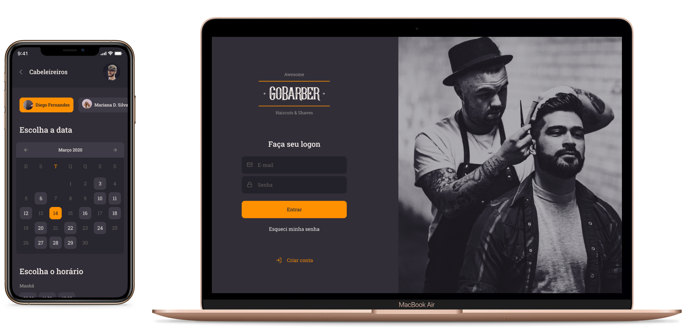

<h1 align="center">
	
</h1>

<p align="center">
	<a href="https://www.linkedin.com/in/paulorcvieira/" target="_blank" rel="noopener noreferrer"></a>
  <a href="https://github.com/paulorcvieira/gobarber/blob/master/README.md"></a>
</p>



<p align="center">
  <a href="#page_with_curl-sobre">Sobre</a>&nbsp;&nbsp;&nbsp;|&nbsp;&nbsp;&nbsp;
  <a href="#books-requisitos">Requisitos</a>&nbsp;&nbsp;&nbsp;|&nbsp;&nbsp;&nbsp;
  <a href="#rocket-começando">Começando</a>&nbsp;&nbsp;&nbsp;|&nbsp;&nbsp;&nbsp;
  <a href="#gear-iniciando-back-end">Node.js</a>&nbsp;&nbsp;&nbsp;|&nbsp;&nbsp;&nbsp;
  <a href="#computer-iniciando-front-end">ReactJS</a>&nbsp;&nbsp;&nbsp;|&nbsp;&nbsp;&nbsp;
  <a href="#iphone-iniciando-mobile">React Native</a>
</p>

## :page_with_curl: Sobre
Este repositório contém um API RESTful construida com Node.js como backend, uma aplicação em ReactJS como frontend e um app mobile em React Native, todos utilizando TypeScript.

Essa é a aplicação do GoBarber, que é uma plataforma de agendamento de serviços para proprietários de barbearias ou salões de beleza. Nessa aplicação o usuário consegue ter acesso a todos os prostadores de serviços cadastrados através de um aplicativo mobile, com isso usuário consegue escolher um prestador para marcar seu agendamento.

Já o prestador de serviço, através de um interface Web, consegue ter acesso a todos os seus horários agendados, podendo ver todos os que estão ocupados, quanto os que estão disponíveis.

**Node.js**: é uma API RESTful que faz todo o CRUD da aplicação, persistência de dados, tratativa de exceções e que serve dados tanto ao front-end quanto ao mobile.

- [RESTful API](https://github.com/paulorcvieira/gobarber/tree/master/api)

**ReactJS**: é uma página Web no qual o prestador de serviço tem acesso a todo o seu calendário de agendamentos.
- [Web client](https://github.com/paulorcvieira/gobarber/tree/master/web)

**React Native**: é um aplicativo em que o usuário tem acesso a todos os prestadores de serviço cadastrados no App, com isso ele pode fazer um agendamento que o prestador de preferência.
- [Mobile client](https://github.com/paulorcvieira/gobarber/tree/master/mobile)

## :books: Requisitos
- [**Git**](https://git-scm.com/) para clonar o projeto.
- [**Node.js**](https://nodejs.org/en/) instalado.
- [**Docker**](https://www.docker.com/) rodando um container PostgreSQL, MongoDB e Redis.
- Um dispositivo ou emulador iOS ou Android

## :rocket: Começando
``` bash
  # Clonar o projeto:
  $ git clone https://github.com/paulorcvieira/gobarber

  # Entrar no diretório:
  $ cd gobarber

  # Iniciar Bancos de Dados
  $ docker start redis mongodb postgres
```

## :gear: Iniciando back-end
```bash
  # Entrar no diretório do back-end:
  $ cd api

  # Instalar as dependências:
  $ yarn

  # Rodar as migrations:
  $ yarn typeorm migration:run

  # Rodar a aplicação:
  $ yarn dev:server
```

## :computer: Iniciando front-end
```bash
  # Entrar no diretório do front-end:
  $ cd web

  # Instalar as dependências:
  $ yarn

  # Rodar a aplicação:
  $ yarn start
```

## :iphone: Iniciando mobile
```bash
  # Entrar no diretório do mobile:
  $ cd mobile

  # Instalar as dependências:
  $ yarn

  # Configurar a porta local com a porta virtual
  $ adb reverse tcp:3333 tcp:3333

  # Rodar a aplicação:
  $ yarn ios ou yarn android
```

## 📝 Licença

Este projeto está licenciado sob a Licença MIT - consulte o arquivo [Licença](LICENSE) para obter detalhes.

---

Made with 💜 &nbsp;by Paulo Vieira 👋 &nbsp;[See my LinkedIn](https://www.linkedin.com/in/paulorcvieira/)
